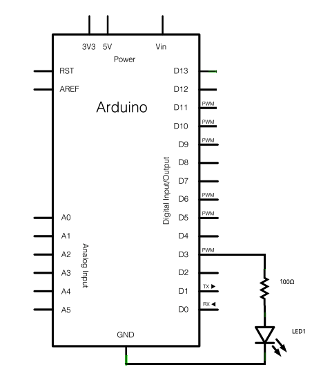

# Mitsubishi_PKFY-P_AC_Control
Control the Mitsubishi PKFY-P VHM AC unit via IR signal


Table of contents
-----------------

- [Original work](#original-work)
- [Introduction](#introduction)
- [How to](#how-to)
- [TODO](#todo)
- [License](#license)


Original work
------------

This project is based on the original work by: [r45635/HVAC-IR-Control](https://github.com/r45635/HVAC-IR-Control).
With some modifications it works with the old Mitsubishi PKFY-P VHM wall mounted AC units.


The IR signals were decoded with the work of: [ToniA/Raw-IR-decoder-for-Arduino](https://github.com/ToniA/Raw-IR-decoder-for-Arduino).


Introduction
------------
After analyzing the code transmitted by the IR remote signal, the meaning of each command was interpreted.

However, only the most important commands have been studied and copied in order to control AC.

These commands are: Turn the AC on/off, temperature control, mode control, fan control and vane control.


How to
------------
Just add the folder “Mitsubishi_PKFY-P” to the Arduino as a library and you're ready to use it.

Then using the method "sendMitsubishi(...)" make normal combinations to control the AC.


Mitsubishi PKFY-P VHM function
```
void sendMitsubishi(
 uint8_t                 ON,              // Example: true
 HvacMode                HVAC_Mode,       // Example HVAC_HOT  HvacMitsubishiMode
 uint8_t                 HVAC_Temp,       // Example: 21 (°c)
 HvacFanMode             HVAC_FanMode,    // Example: FAN_SPEED_AUTO  HvacMitsubishiFanMode
 HvacVanneMode           HVAC_VanneMode   // Example: VANNE_AUTO_MOVE  HvacMitsubishiVanneMode
);
```





TODO
------------
- Analyze the IR signal for time control and timer to control the AC, since this was not analyzed.
- Allow other pins to be used instead of only pin 3 but with PWM. On 328p it can be: 3, 5, 6, 9, 10 and 11.


License
------------

This project is licensed under the GNU General Public License v3.0 - see the [LICENSE.md](LICENSE.md) file for details.
